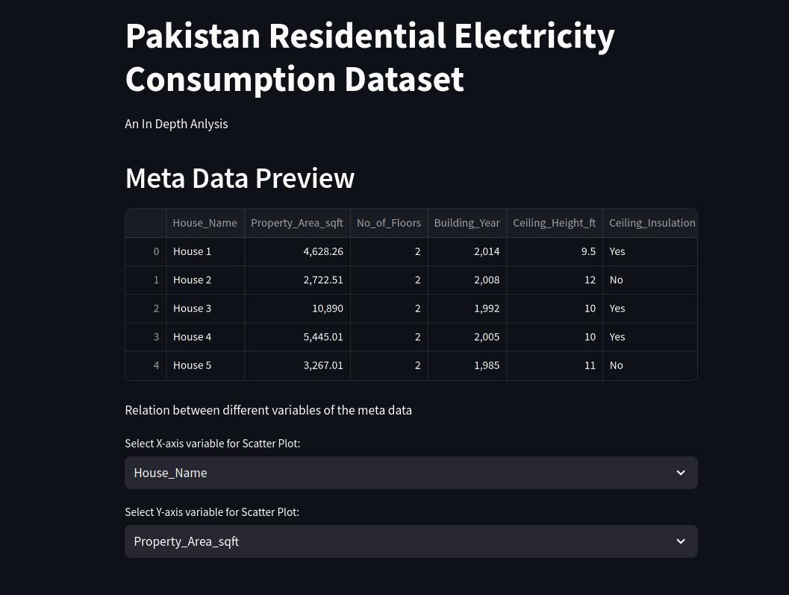
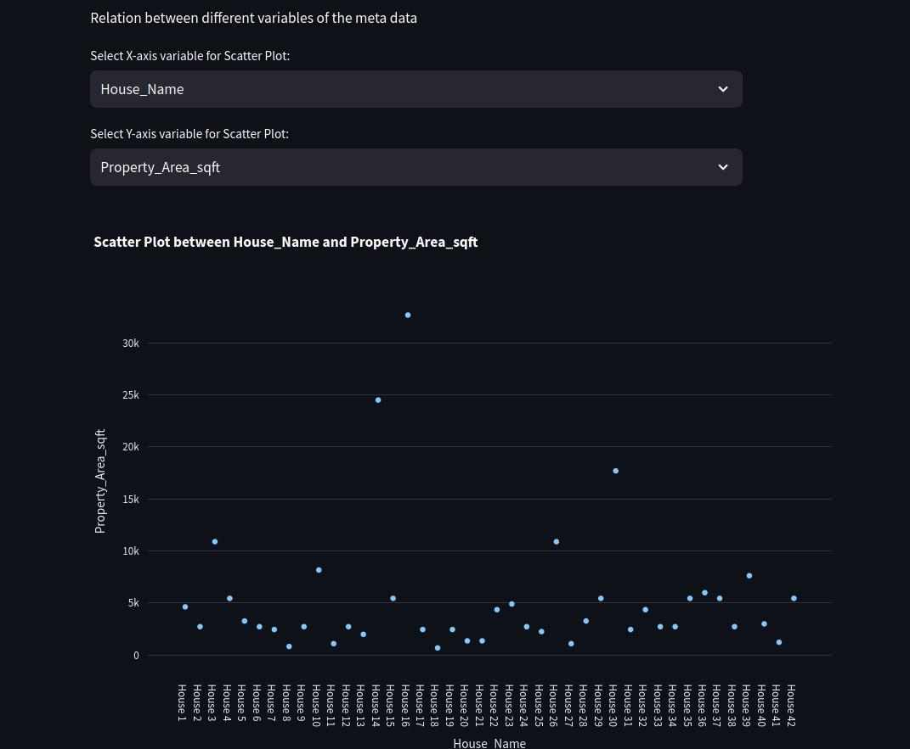
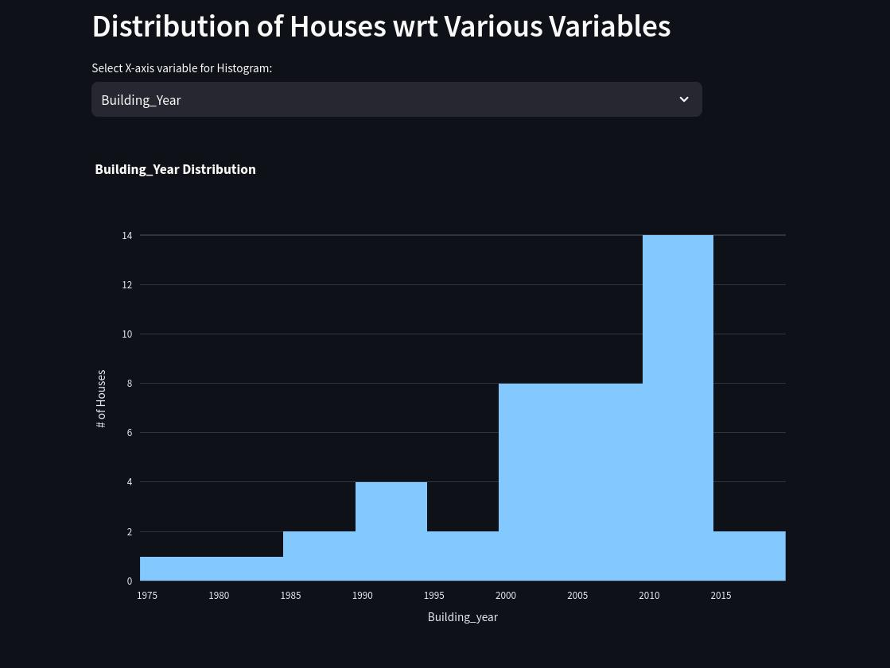
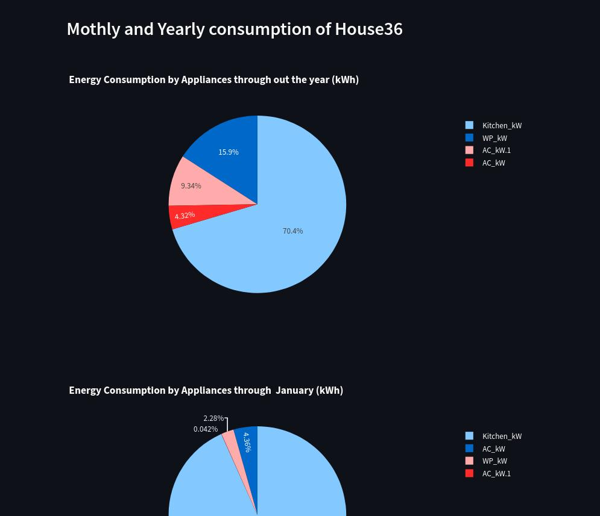

# Pakistan-Residential-Electricity-Consumption (PRECON)
A repo to host analysis on PRECON dataset  

# The PRECON Dataset
PRECON is a first of its kind extensive dataset of electricity consumption patterns of users in developing countries. The dataset has been collected through smart meters over a period of one year and comprise of data of users belonging to different demographics and different social and financial backgrounds. It provides details of electricity consumption data and meta-data of houses opted for data collection. Also, provided are the details on high electricity consumption devices and the load profile of the whole house. The aim of this data collection and processing exercise is to understand the electricity consumption patterns of users in the developing world. A sound realization of consumption patterns can help in the development of intelligent smart grids and better demand-side management tools.

The dataset and paper can be found [here](https://web.lums.edu.pk/~eig/precon.html)

# Analysis
An exploratory data analysis is conducted in this code base and hosted in the form of an streamlit app.
It covers:

- Dataset variables overview  
  

  

- Realtionship between all the variables of the dataset in the form of scatter plots

  

- Visualizing distribuition of houses w.r.t variables

  

- Total and appliance wise consumption of each house througt the whole time period

  

- Consumption pattern of each house for all months of the year

  

